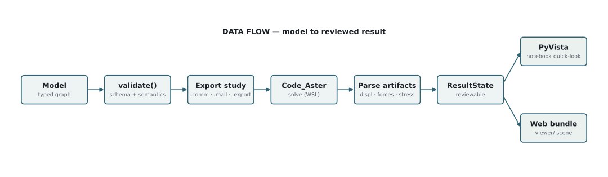

# Current architecture

Tuba v4 has one production workflow:

1. A **Tuba model** owns the authored piping structure, materials, sections, supports, loads, operations, and imported context.
2. The solver boundary exports a Code_Aster study and runs Code_Aster as an external process. Exported input files alone are an incomplete handoff.
3. **Artifact import** validates the study, mesh, result, and execution lineage before linking Code_Aster data into an `AnalysisRun` with persistent `ResultState` and transient `FEAResults` records.
4. Reporting builds renderer-independent engineering review records from those supplied authoritative records. It never substitutes for a solve.
5. One of the two supported visualization paths displays the model or processed results.

## Ownership boundaries

| Boundary | Current owner | Contract |
| --- | --- | --- |
| Model authoring | `tuba.model`, `tuba.builder` | Validated piping and operation records |
| Study generation and execution | `tuba.solver` | Native Tuba export plus external Code_Aster execution |
| Artifact import | `tuba.analysis` | Provenance-checked parsed solver evidence |
| Engineering review | `tuba.reporting` | Tables, diagnostics, compliance status, and report outputs |
| PyVista quick-look | `tuba/plotting/` | Interactive/notebook result views and PLY, glTF, or Blender export |
| Reviewable web scene | `tuba/visualization/` and `viewer/` | Portable semantic scene and browser review bundle |

The two display paths are complementary, not interchangeable implementations and not optional replacements for Code_Aster. Use one path per notebook or example. See [visualization architecture](visualization.md) for their exact responsibilities and [the workflow](../workflow.md) for an end-to-end sequence.
