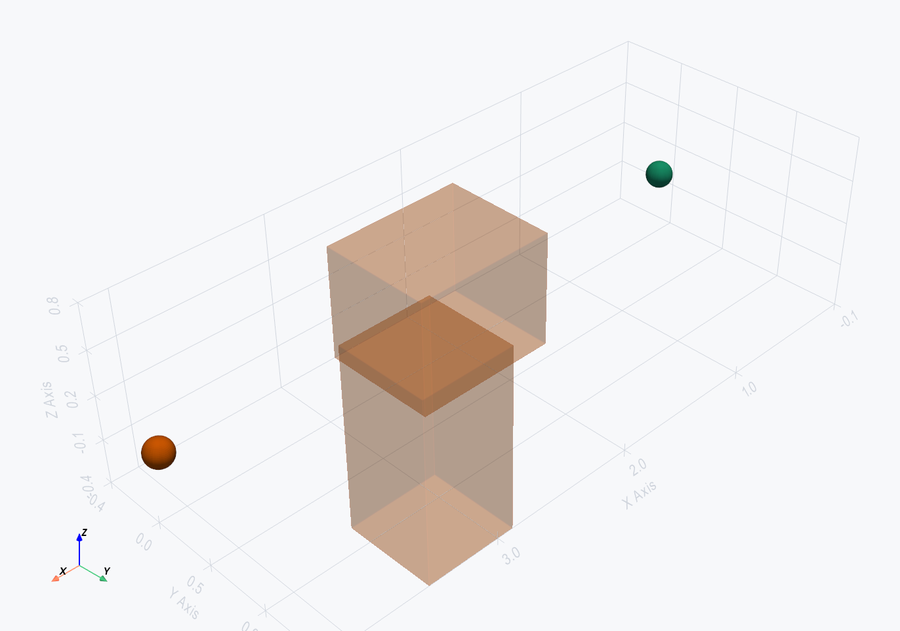
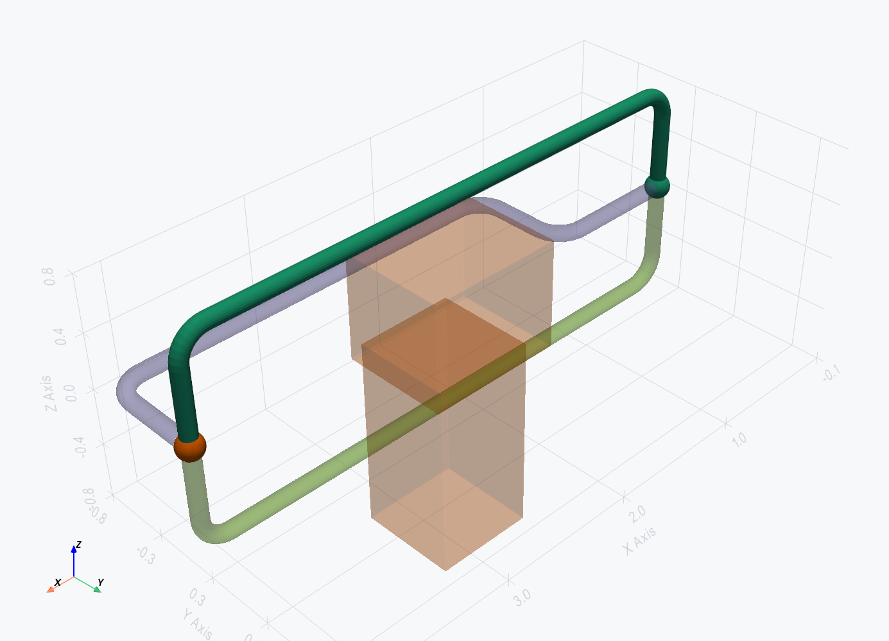

# Route candidates, not magic signoff

Autorouting generates and reviews pipe-centerline candidates. It can apply a selected candidate to a model, export Code_Aster studies, and write route reports. Engineering acceptance still requires a real Code_Aster solve and imported result artifacts.





## Implementation map

| Concept | Public API | Owner |
| --- | --- | --- |
| Request data | `RouteEndpoint`, `PipeRouteRequest`, `RoutingConstraints`, `RoutingCostWeights` | `tuba.routing.types` |
| Grid and spaces | `RoutingGridSpec`, `RoutingSpace`, `RoutingZone` | `tuba.routing.grid`, `tuba.routing.spaces` |
| Single-pipe search | `GridRouter.route(...)` | `tuba.routing.astar` |
| Cost model | `RouteCostModel`, `score_candidate` | `tuba.routing.cost_model`, `tuba.routing.cost` |
| Model mutation | `build_candidate_patch`, `apply_candidate_to_model` | `tuba.routing.adapter` |
| Expansion candidates | `ExpansionAwareRouter`, `ExpansionLoopGenerator` | `tuba.routing.hybrid`, `tuba.routing.expansion` |
| Network routing | `NetworkRouter`, `NetworkRouteRequest` | `tuba.routing.network` |
| Solver loop | `AutoroutingAgent`, `SolverLoopConfig`, `SolverLoopScorer` | `tuba.routing.agent`, `tuba.routing.solver_loop` |
| Reports and review | `write_route_report`, `show_route_scene`, `build_visualization_scene` | `tuba.routing.report`, `tuba.routing.visualization`, `tuba.visualization` |

## Define the route request

```python
from tuba import Model
from tuba.routing import GridRouter
from tuba.routing.types import (
    PipeRouteRequest,
    RouteEndpoint,
    RoutingConstraints,
    RoutingCostWeights,
    RoutingGridSpec,
)

model = Model("RoutingDemo")
model.add_material("steel", E=210e9, nu=0.3, rho=7850.0, alpha=12e-6)
model.add_pipe_section("DN100", OD=0.1143, WT=0.00602)
model.add_obstacle(
    id="equipment_box",
    type="cuboid",
    min_point=(1.5, -0.4, -0.4),
    max_point=(2.5, 0.4, 0.4),
)

request = PipeRouteRequest(
    id="P-100",
    start=RouteEndpoint(
        "PumpNozzle",
        (0.0, 0.0, 0.0),
        direction=(1.0, 0.0, 0.0),
        min_straight=0.5,
    ),
    goal=RouteEndpoint(
        "RackTieIn",
        (4.0, 0.0, 0.0),
        direction=(0.0, -1.0, 0.0),
    ),
    section="DN100",
    material="steel",
    constraints=RoutingConstraints(
        clearance=0.10,
        insulation_thickness=0.03,
        min_bend_radius=0.20,
    ),
    costs=RoutingCostWeights(length=1.0, bend=5.0, vertical=2.0, support_span=0.5),
)
```

Endpoints can constrain departure/approach directions and minimum straight lengths. Obstacles and existing pipes are inflated by pipe radius, insulation thickness, and requested clearance.

## Search and rank candidates

```python
router = GridRouter(
    RoutingGridSpec(cell_size=0.25, margin=1.0),
    candidate_count=3,
)
result = router.route(model, request)

for candidate in result.candidates:
    print(candidate.is_valid, candidate.cost, candidate.cost_breakdown)

selected = result.selected
```

The grid bounds the search volume and `max_cells` prevents accidental unbounded work. Smaller cells increase precision and cost. The router respects endpoint constraints, simplifies the grid path, validates bend geometry, and ranks valid alternatives by additive terms such as length, bends, vertical travel, support span, support count, and insulation data.

`clearance`, `rack_preference`, and `direction_change` weights are typed extension points unless a local cost function consumes them.

## Apply a selected route

```python
from tuba.routing.adapter import apply_candidate_to_model

created_element_ids = apply_candidate_to_model(
    model,
    selected,
    request,
    add_supports=True,
    support_spacing=2.0,
)
```

A candidate is points and segments until this explicit adapter mutates the model. Turns require `constraints.min_bend_radius` or per-segment radius metadata.

## Reports and solver-loop review

```python
from tuba.routing import AutoroutingAgent
from tuba.routing.solver_loop import SolverLoopConfig

run = AutoroutingAgent(
    router=router,
    solver_config=SolverLoopConfig(
        run_solver=False,
        export_study=True,
        max_solver_candidates=2,
        work_root="routing_reports/studies",
        load_case="Hot",
    ),
    output_root="routing_reports",
).route_pipe(
    model,
    request,
    apply=True,
    add_supports=True,
    support_spacing=2.0,
)
```

With `run_solver=False`, exported `.comm`, `.mail`, and `.export` files are handoff artifacts, not completed solver results. With `run_solver=True`, Code_Aster must be available and the produced artifacts must parse before solver-backed candidate metadata is trusted.

## Expansion-aware routing

```python
from tuba.routing import (
    ExpansionAwareRouter,
    ExpansionLoopGenerator,
    ExpansionLoopSpec,
    SolverAcceptanceCriteria,
    ThermalRouteRequirement,
)

hot_request = PipeRouteRequest(
    id="HOT-EXP-100",
    start=RouteEndpoint("PumpDischarge", (0.0, 0.0, 0.0), direction=(1.0, 0.0, 0.0)),
    goal=RouteEndpoint("RackTieIn", (8.0, 0.0, 0.0), direction=(1.0, 0.0, 0.0)),
    section="DN100",
    material="steel",
    constraints=RoutingConstraints(clearance=0.10, insulation_thickness=0.05, min_bend_radius=0.25),
    thermal_requirements=ThermalRouteRequirement(
        design_temperature_c=180.0,
        reference_temperature_c=20.0,
        line_length_m=8.0,
        thermal_expansion_coefficient=12e-6,
    ),
    solver_acceptance=SolverAcceptanceCriteria.hot_line_defaults(),
)

expansion_router = ExpansionAwareRouter(
    base_router=router,
    loop_generator=ExpansionLoopGenerator((
        ExpansionLoopSpec(
            family="u_loop",
            width_m=2.0,
            depth_m=0.8,
            plane="xy",
            min_clearance_m=0.15,
        ),
    )),
)
```

The current generator emits U-loop candidates only. `z_loop` and `offset_loop` are typed future families, not current generator output. Reserved loop envelopes can be protected during network routing.

`SolverAcceptanceCriteria` currently enforces expansion ratio, sustained ratio, and maximum anchor reaction when real solver results exist. Other typed fields are review or future scorer inputs, not active acceptance gates.

## Multiple pipes

`NetworkRouter` processes requests in deterministic order and applies accepted earlier routes to a working copy so later routes see them as obstacles. It checks centerline conflicts and reserved-envelope intrusion with bounded repair attempts.

Supported order strategies are `given`, `large_bore_first`, `critical_first`, and `least_flexible_first`.

```python
from tuba.routing import NetworkRouter
from tuba.routing.types import NetworkRouteRequest

network_result = NetworkRouter(
    grid_spec=RoutingGridSpec(cell_size=0.5, margin=2.0)
).route_network(
    model,
    NetworkRouteRequest(
        id="rack-lines",
        pipe_requests=[request, hot_request],
        order_strategy="large_bore_first",
        max_reroute_attempts=20,
    ),
)
```

Network routing is sequential with repair attempts, not global multi-line optimization.

## Review outputs

```python
from tuba.routing.report import write_route_report

write_route_report(result, "routing_reports/P-100", model=model)
```

Use `show_route_scene(...)` for the existing PyVista quick-look path, or `build_visualization_scene(..., route_results=[result])` plus `write_scene_bundle(...)` for the browser path. Choose one visualization path per example.

## Troubleshooting

| Symptom | Likely cause | Action |
| --- | --- | --- |
| `No route found` | Inflated obstacles, tight clearance, or small bounds | Inspect envelopes and revise bounds, grid, or clearance |
| `outside routing grid bounds` | An endpoint lies outside explicit bounds | Expand or remove the explicit bounds |
| `exceeding max_cells` | Grid is too fine for its volume | Increase cell size or reduce bounds |
| `Route bends require an explicit bend radius` | A turn has no radius data | Set `min_bend_radius` or segment metadata |
| `Solver loop failed` | Runtime or study execution failed | Inspect `study.mess`, stdout/stderr, and run `code_aster_doctor --check` |

## Current limitations

- Routes are centerline candidates and require engineering review.
- Mesh obstacles need explicit routing bounds; exact mesh voxelization is not implemented.
- Network routing is sequential rather than globally optimized.
- Expansion-loop generation emits U-loops only.
- Support optimization, nonlinear friction, gaps, lift-off, and construction sequencing are not complete routing solvers.
- A candidate reaches engineering acceptance only after real Code_Aster evaluation and artifact import.
