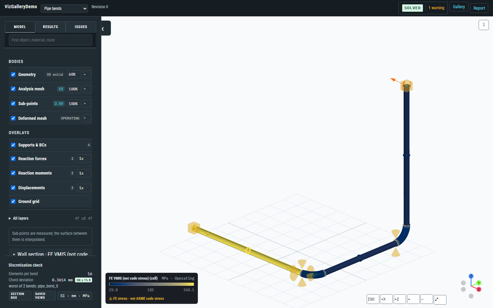

# Tuba v4

Piping engineering in Python: define a piping system, analyse it, and review the results as traceable engineering evidence.

**[Open the review gallery](https://jgwagenfeld.github.io/Tuba_v4/viewer/)** — real analysed piping models in your browser, nothing to install. Each one keeps the authored geometry, the analysis mesh, the pipe-wall results, the deformed shape and the support reactions connected to the run that produced them.

## Start here

- **[Setup](setup.md)** — install Tuba, and the solver when you want to compute your own results.
- **[Tutorial](tutorial.md)** — build a model, analyse it, and read the answers back.
- **[Examples](examples.md)** — what each published review demonstrates.
- **[Modeling](modeling.md)** — sections, supports, placements, fragments and interop.

## Where results come from

Analysis runs on [Code_Aster](https://code-aster.org), a separate open-source solver. Authoring, routing, geometry and review work without it; computing stresses, displacements, reactions, thermal expansion and operating-state clearances does not.

Writing solver input files is a handoff, not an analysis. Until the solver has run and Tuba has imported what it produced, a study has no results — and Tuba says so rather than filling the gap with a plausible number.

## Two ways to look at results

- `tuba/plotting/` gives PyVista quick-look and export views while you work.
- `tuba/visualization/` and `viewer/` produce the shareable web review bundles behind the gallery.

Use one path per notebook or example.
