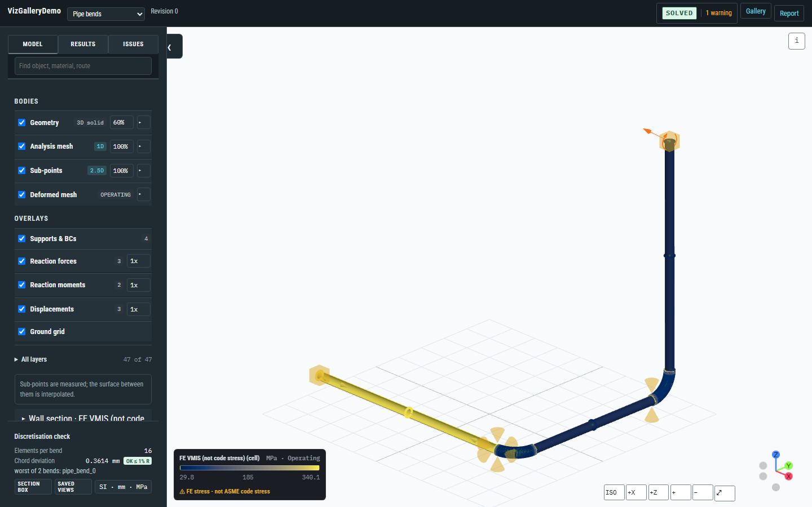

# Tuba v4

Tuba is an open-source Python library for modeling piping systems, running Code_Aster analyses, and displaying the results.

## Gallery

Every review opens in your browser, no install needed. All except *Imported components* show imported Code_Aster results. [Browse the full gallery](https://jgwagenfeld.github.io/Tuba_v4/viewer/), or read what each one demonstrates on [Examples](examples.md).

-   

    **Pipe bends** - What happens to a pressurised line held at both ends?

-   

    **Load-case preparation** - How do sustained, thermal, occasional and pressure loads change the same pipe?

-   

    **Load transfer** - What do the supports and the steel underneath actually carry?

-   

    **Thermal expansion** - Where does a hot line move, and what does it reach?

-   

    **Nonlinear friction** - How does friction change the same pipe and load path?

-   

    **Multipipe rack** - How do three lines at different temperatures load one shared rack?

-   

    **Beam orientation** - How does a rolled I-section change the response to the same tip force?

-   

    **3D solid** - How does 1D beam pipework transition into a 3D solid tee junction?

## Start here

- **[Try browser editing](setup.md#try-a-model-in-the-browser)** — choose **Build**, edit `model.py`, and **Update geometry** without installing Tuba. The preview is unsolved; **Review** retains published Code_Aster results and marks them outdated after edits.
- **[Setup](setup.md)** — install Tuba, and the solver when you want to compute your own results.
- **[Tutorial](tutorial.md)** — build a model, run Code_Aster, and display the results.
- **[Examples](examples.md)** — what each published review demonstrates.
- **[Modeling](modeling.md)** — sections, supports, placements, fragments and interop.

## Where results come from

Analysis requires [Code_Aster](https://code-aster.org), installed separately. Modeling, geometric routing, and viewing existing results do not require a local solver installation. Stress, displacement, reaction, and operating-state clearance calculations require Code_Aster result files.

Exporting `.comm`, `.mail`, and `.export` input files does not run an analysis. Results are available after Code_Aster has run and Tuba has imported its output.

## Result visualization

- `tuba/plotting/` gives PyVista quick-look and export views while you work.
- `tuba/visualization/` and `viewer/` produce the shareable web review bundles behind the gallery.

Use one path per notebook or example.
