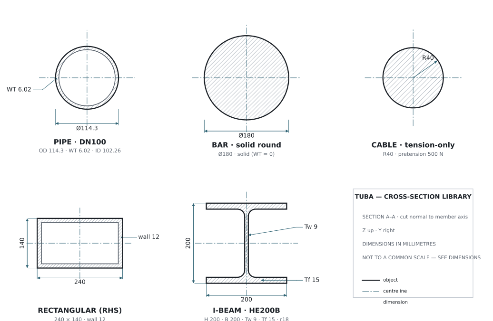
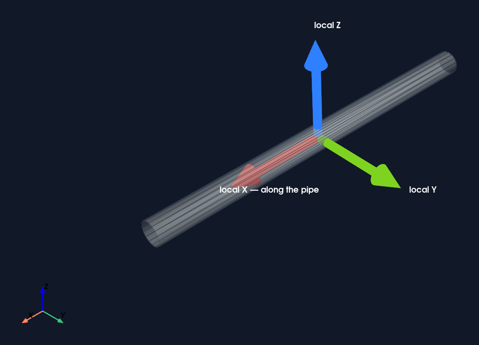
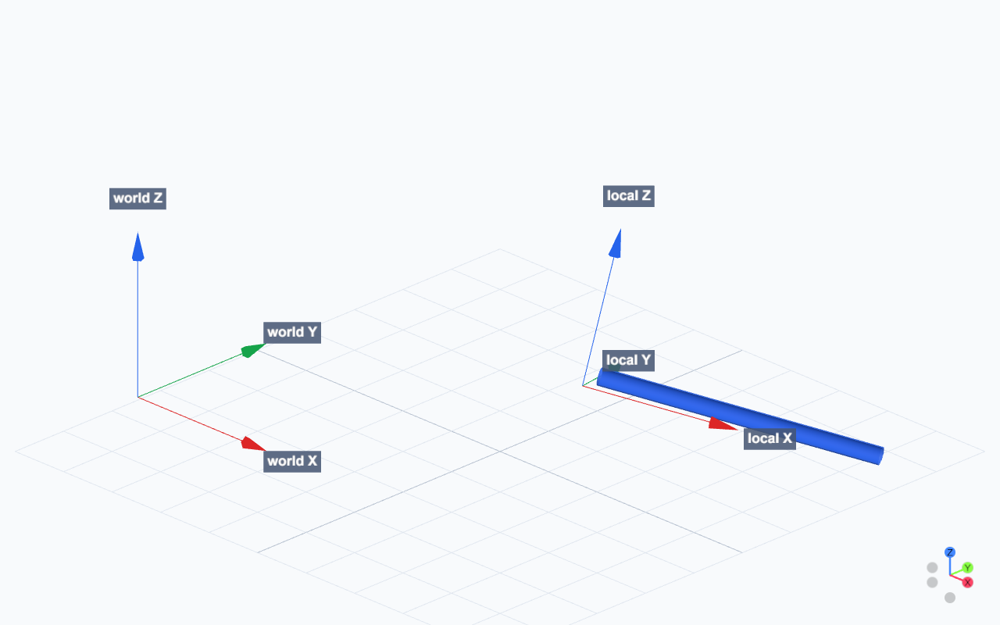
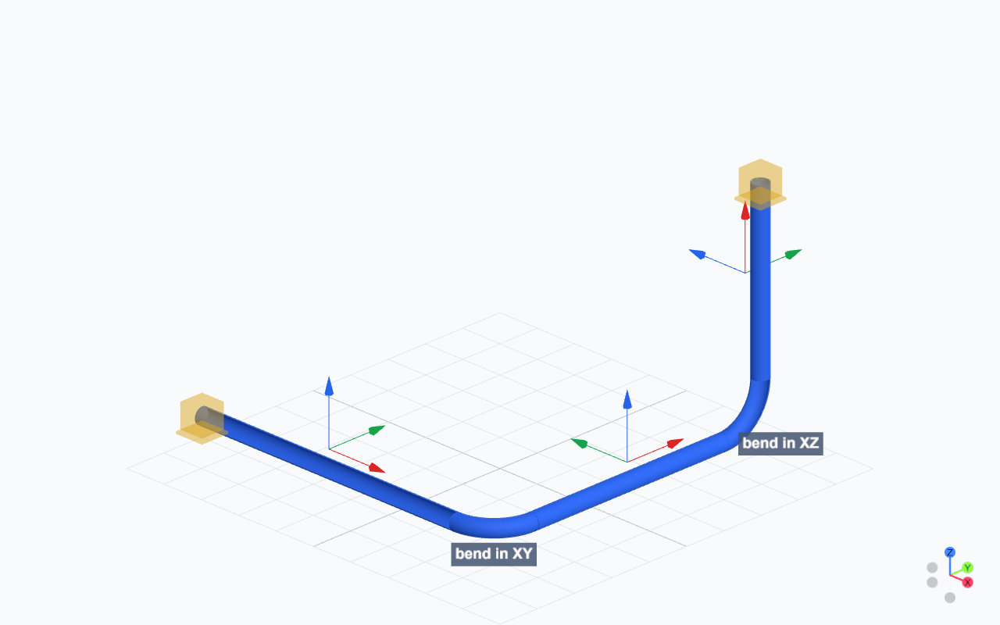
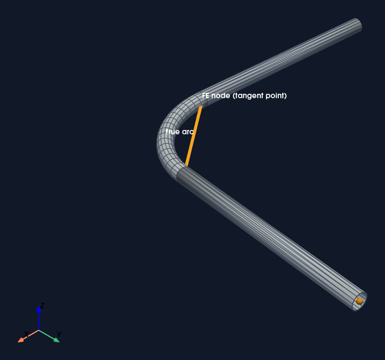
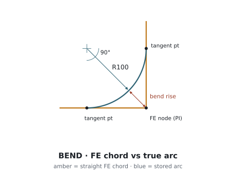
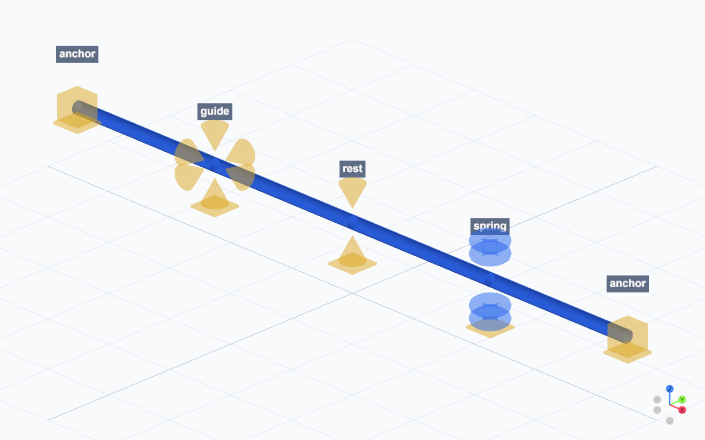

# Modeling

A Tuba model is a typed engineering graph. Materials and cross-sections define elements; nodes and elements define geometry; supports and operations define boundary conditions and loads. Validation checks that graph before a Code_Aster study is written.

## Cross-sections



Cross-sections are named definitions referenced by elements. In a pipe section, `OD` is outside diameter and `WT` is wall thickness. Both are meters.

```python
model.add_pipe_section(
    "DN100",
    OD=0.1143,
    WT=0.00602,
    corrosion_allowance=0.001,
)

model.add_rectangular_section(
    "RackTube",
    height_y=0.10,
    height_z=0.08,
    thickness_y=0.006,
    thickness_z=0.006,
)
```

| Type | Required values | Main validation |
| --- | --- | --- |
| `PipeSection` | `OD`, `WT`, optional corrosion allowance | `OD > 0`, `WT > 0`, `2 * WT < OD` |
| `BarSection` | `OD`, `WT` | `OD > 0` |
| `CableSection` | `radius`, optional pretension | `radius > 0` |
| `RectangularSection` | `height_y`, `height_z`, optional wall thicknesses | Positive outside dimensions |
| `IBeamSection` | `profile_name` | Non-empty catalog profile |

During export, pipe and bar sections become circular Code_Aster section data, rectangular sections become rectangular beam data, I-beams use catalog properties, and cables emit area and initial pretension. Wrong section geometry changes stiffness, weight, stress, clearance, and visualization radius.

## Global and Local coordinate systems

All node coordinates use one right-handed global X/Y/Z frame. Every element also has a local triad: local X runs along the member, local Z is the member up direction, and local Y completes the right-handed basis.



Section orientation, bend planes, and local axial, shear, bending, and torsion results use this element frame.

## Placement frames



A placement frame retains reusable local geometry, IFC placement, and editing provenance. `axis` is local Z, `ref_direction` is projected to local X, and local Y is computed from Z cross X. Local points map through `origin + basis * point`.

```python
from tuba import Model, PlacementFrame

model = Model("Frames")
model.add_placement_frame(
    PlacementFrame(
        id="rack_A",
        origin=(10.0, 0.0, 0.0),
        axis=(0.0, 0.0, 1.0),
        ref_direction=(1.0, 0.0, 0.0),
    )
)

point = model.to_global_point(
    (0.5, 0.0, 0.0),
    frame="placement_frame:rack_A",
)
```

Node coordinates remain model-global even when placement metadata exists. `CoordinateSystem` rejects zero, non-orthogonal, and left-handed axes. `PlacementFrame` rejects colinear `axis` and `ref_direction` values.

### Imported-component model review

The model-review bundle shows a programmatic pipe connected to an imported component, including world and local frames. It contains geometry and model provenance only—**it has no solver results**.

<iframe class="viewer-frame" title="Imported component model review" src="https://jgwagenfeld.github.io/Tuba_v4/viewer/?bundle=imported_component_mixed_demo&amp;embed=1"></iframe>

[Open the imported-component model review](https://jgwagenfeld.github.io/Tuba_v4/viewer/?bundle=imported_component_mixed_demo).

## Pipe builder orientation

The pipe builder is a moving frame. `run` advances along the current direction; bend commands rotate that direction and retain explicit bend geometry.







| Command | Effect | Common error |
| --- | --- | --- |
| `start(point)` | Places or reuses the start node | Routing before a start point exists |
| `set_direction(vector)` | Sets the next run direction | Passing a zero vector |
| `run(length)` | Adds a straight element | Using an unintended sign or direction |
| `bend(radius, angle, plane)` | Adds an angle-driven circular bend | Selecting the wrong plane |
| `bend_to(point, radius, plane_normal)` | Fits a bend to a target point | Impossible target/radius or ambiguous plane |

A bend stores its center, normal, radius, angle, and tangent metadata. The finite-element nodes lie on the tangent-intersection chord while renderers can use the stored true arc.

## Supports



Supports are boundary-condition records attached to real nodes. Their geometry is a review aid; the support record drives the solver constraint.

## Schemas and serialized models

`model.to_dict()` produces a JSON-compatible structure checked by `MODEL_SCHEMA_V4`. Schema validation checks record shape; `model.validate()` checks relationships and engineering semantics.

```python
from tuba import Model
from tuba.schema import validate_model_dict

data = model.to_dict()
validate_model_dict(data)

round_tripped = Model.from_dict(data)
round_tripped.validate()
```

```json
{
  "meta": {"project_name": "Demo", "standard": "ASME_B31.3", "version": "tuba.model.v4"},
  "materials": {"Steel": {"E": 210000000000.0, "nu": 0.3}},
  "sections": {"DN100": {"type": "pipe", "OD": 0.1143, "WT": 0.00602}},
  "nodes": {"N0": [0.0, 0.0, 0.0], "N1": [2.0, 0.0, 0.0]},
  "elements": [
    {"id": "pipe_0", "type": "pipe_straight", "n1": "N0", "n2": "N1", "section": "DN100", "material": "Steel"}
  ],
  "supports": [{"id": "support_0", "node": "N0", "type": "anchor"}],
  "load_cases": {
    "Operating": {
      "gravity": true,
      "internal_pressure": 1200000.0,
      "temperature": 180.0,
      "ref_temperature": 20.0
    }
  }
}
```

| Boundary | API | Example failure |
| --- | --- | --- |
| Schema shape | `validate_model_dict(data)` | Missing block or unsupported record type |
| Model semantics | `model.validate()` | Missing reference, zero-length element, invalid operation field |
| Solver runtime | `solve_exported_study(...)` | Code_Aster missing or execution failed |
| Artifact import | `parse_result_artifacts(...)` | Missing or empty required result table |

## How errors work

Tuba fails at four ordered boundaries:

1. Authoring methods reject impossible local input, such as a zero bend axis.
2. `SchemaValidationError` reports data that does not match `MODEL_SCHEMA_V4`.
3. `ModelValidationError` collects semantic model failures so they can be fixed together.
4. Solver and artifact failures remain explicit Code_Aster setup, execution, or import failures.

```python
from tuba.validation import ModelValidationError

try:
    model.validate()
except ModelValidationError as exc:
    print(str(exc))
```

Common messages include `Pipe section ... WT is too large for OD`, missing section/material/node references, invalid placement frames, zero-length elements, unsupported operation quantities, and wind fields without a finite non-zero direction.

Debug in that same order. Import the result artifacts before plotting, reviewing, or reporting stress, displacement, reaction, compliance, or operating-state results. Never replace a blocked solver or missing table with fabricated values.
