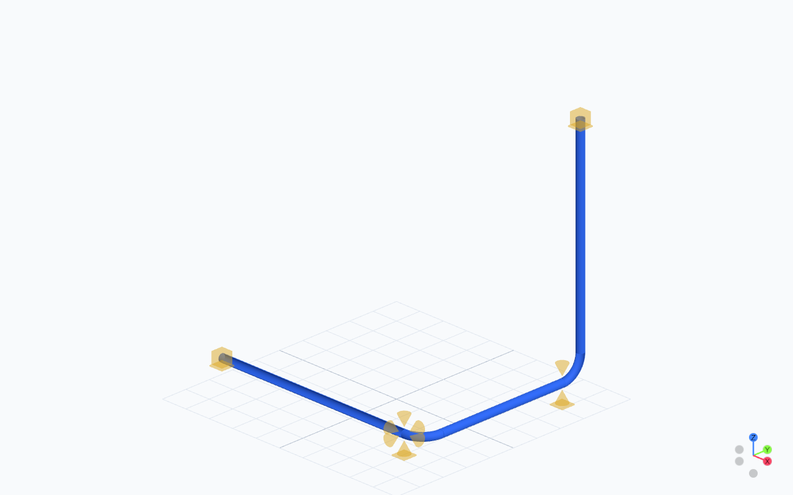
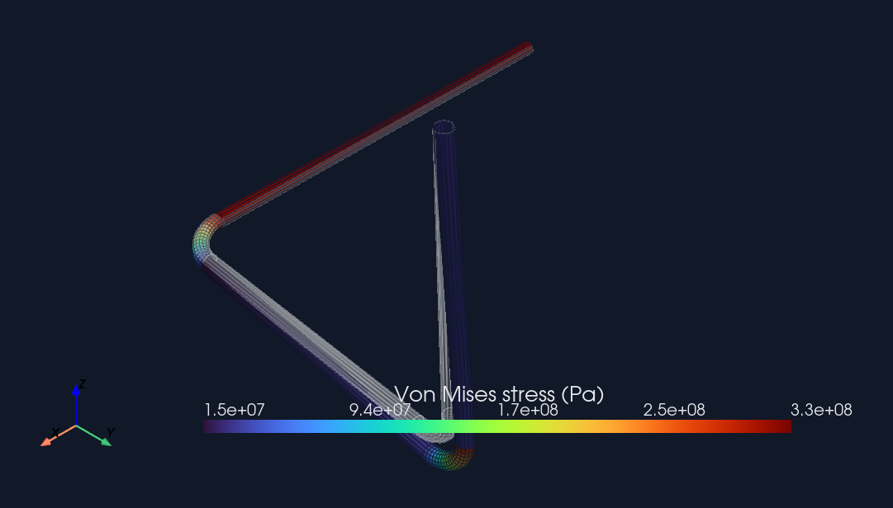

# Build and solve a first pipe

This tutorial follows the complete engineering boundary:

```text
model -> validate -> export -> Code_Aster solve -> import -> processed result review
```

The exported study files are a handoff. A `.comm`, `.mail`, or `.export` file does not prove that Code_Aster ran or that any stress, displacement, reaction, or compliance result exists.

## What you are building



The first figure is model geometry only. After a real Code_Aster solve, the same model can be inspected through the PyVista quick-look path:



## Prerequisites

```powershell
.\.venv\Scripts\python.exe -m pip install ".[course]"
.\.venv\Scripts\python.exe -m tuba.solver.code_aster_doctor --check
```

If the doctor is blocked, stop after export inspection or load an existing solved artifact directory. See [Setup](setup.md).

## Build, solve, and publish the review bundle

```python
from pathlib import Path

from tuba import Model
from tuba.solver.aster import CodeAsterSolver
from tuba.visualization import build_visualization_scene, write_scene_bundle

work_dir = Path("runs/first_pipe_operating")

model = Model(project_name="FirstPipe")
model.add_material(
    "steel",
    E=210e9,
    nu=0.3,
    rho=7850.0,
    alpha=12e-6,
    allowable_stress={20.0: 140e6, 180.0: 120e6},
)
model.add_pipe_section("DN100", OD=0.1143, WT=0.00602)

with model.pipe(section="DN100", material="steel", route="P-100") as pipe:
    pipe.start([0.0, 0.0, 0.0], support="anchor")
    pipe.run(2.0)
    pipe.bend(radius=0.30, angle=90.0, plane="XY")
    pipe.run(1.5)
    pipe.end(support="anchor")

operating = model.define_operation(
    "Operating",
    gravity=True,
    pressure=1.2e6,
    temperature=180.0,
    ref_temperature=20.0,
)
operating.add_field(
    "temperature",
    160.0,
    route_id="P-100",
    station_start=0.0,
    station_end=1.2,
)
model.validate()

solver = CodeAsterSolver(
    work_dir=str(work_dir),
    exec_method="wsl",
    wsl_distro="Ubuntu",
)
study = solver.export_analysis_study(model, "Operating", work_dir)
run = solver.solve_exported_study(model, study)

scene = build_visualization_scene(
    model,
    analysis_meshes=[run.analysis_mesh] if run.analysis_mesh is not None else [],
    result_states=[run.result_state],
)
write_scene_bundle(scene, work_dir / "review_scene")
```

The staged `CodeAsterSolver` path keeps export, execution, and import independently inspectable. `model.solve()` is the shorter convenience when that separation is not needed.

## Units

Tuba model values use SI units.

| Quantity | Unit | Example |
| --- | --- | --- |
| Length, diameter, wall thickness | m | `OD=0.1143` means 114.3 mm |
| Pressure | Pa | `1.2e6` means 1.2 MPa |
| Temperature | deg C | `180.0` |
| Force | N | Solver reactions |
| Young's modulus and stress | Pa | `E=210e9` means 210 GPa |
| Thermal expansion | 1/K | `alpha=12e-6` |

## Expected files

| Artifact | Created at | Result evidence? |
| --- | --- | --- |
| `study.mail` | Export | No: solver mesh input |
| `study.comm` | Export | No: solver command input |
| `study.export` | Export | No: runner handoff |
| `study_manifest.json` | Export | No: study and provenance metadata |
| `study_tuba_fem.json` | Export | No: solver-name mapping sidecar |
| `study_depl.csv` | Successful solve | Yes: displacement table |
| `study_effo.csv` | Successful solve | Yes: internal-force table |
| `study_reac.csv` | Successful solve | Yes: reaction table |
| `study_sieq.csv` | Successful solve | Yes: equivalent-stress table |
| `study.rmed` | Successful solve when requested | Yes: MED result artifact |
| `review_scene/` | After artifact import | Review surface for the imported state |

Missing or empty required result rows are a failed or incomplete run, never a confident zero.

## Review controls

The browser review keeps task mode independent from evidence destination.

| Task modes | Purpose |
| --- | --- |
| Review | Governing status and overall context |
| Model | Authored geometry and model records |
| Results | Solver-backed fields and result geometry |
| Issues | Diagnostics and issue-focused geometry |

| Evidence destinations | Purpose |
| --- | --- |
| Summary | Review status and governing values |
| Diagnostics | Parser, provenance, scene, and issue diagnostics |
| Compliance | Supplied code checks or an explicit unavailable state |
| Reports | Downloadable review artifacts |

Changing a task does not silently change the selected evidence destination. The Display controls provide load-case and result-field selection, physical or visual deformation, camera presets, zoom, and a true six-plane section box. Section inputs clip crossing geometry in the renderer; they are not object-level hide/show filters.

[Open the Code_Aster review scene](https://jgwagenfeld.github.io/Tuba_v4/viewer/?bundle=code-aster-review).

## Notebook-safe variant

```python
from tuba.analysis.code_aster_notebook import load_or_run_code_aster_results

run = load_or_run_code_aster_results(
    model,
    "Operating",
    "notebooks/code_aster_results/stress_analysis_operating",
    run_solver=True,
    exec_method="wsl",
    wsl_distro="Ubuntu",
)
results = run.results
```

With `run_solver=False`, the directory must already contain real Code_Aster artifacts.

## Done when

The tutorial is complete only when Code_Aster has produced result artifacts and Tuba has imported them as an `AnalysisRun` with a persistent `ResultState`. Export-only output is useful for diagnostics and handoff review, but it is not an engineering evaluation.

## The notebook course


One install command provides every dependency used by all 14 course and
supplemental notebooks:

```powershell
.\.venv\Scripts\python.exe -m pip install ".[course]"
.\.venv\Scripts\jupyter.exe lab notebooks\00_welcome_and_setup.ipynb
```

The first workflow in that notebook builds a piping model, loads or runs
Code_Aster through the configured runtime, imports the generated result
artifacts, and opens an interactive deformed-stress view. Continue with
`notebooks\03_stress_analysis_and_compliance.ipynb` for compliance checks and
`notebooks\04_visualization_gallery.ipynb` for additional result exports.

Course sequence:

| Notebook                                        | Purpose                                                       |
| ----------------------------------------------- | ------------------------------------------------------------- |
| `00_welcome_and_setup.ipynb`                  | Fast complete workflow: model, Code_Aster, interactive result |
| `01_building_piping_systems.ipynb`            | Geometry authoring with the piping DSL                        |
| `02_supports_and_loading.ipynb`               | Supports, boundary conditions, and load cases                 |
| `03_stress_analysis_and_compliance.ipynb`     | Code_Aster-backed stress and ASME B31.3 checks                |
| `04_visualization_gallery.ipynb`              | Result visualization and export formats                       |
| `05_autorouting.ipynb`                        | Deterministic routing and Code_Aster study handoff            |
| `06_structural_frames_and_optimization.ipynb` | Pipe racks and Code_Aster-backed design evaluation            |
| `07_bim_data_exchange.ipynb`                  | JSON and IFC/BIM exchange with solver properties              |
| `08_expansion_aware_autorouting.ipynb`        | Hot-line routing with reserved expansion envelopes            |
| `09_imported_component_mixed_system.ipynb`    | Imported CAD component placement and pipe coupling            |
| `10_interactive_postprocessor.ipynb`          | Focused Code_Aster artifact post-processing                   |

Supplemental notebooks: `autorouting_quick_iteration.ipynb`,
`visualize_elements_and_supports.ipynb`, and
`advanced_piping_design_and_bim.ipynb`.

For focused post-processing, open:

```powershell
.\.venv\Scripts\jupyter.exe lab notebooks\10_interactive_postprocessor.ipynb
```

It loads preserved Code_Aster artifacts by default, renders interactive
PyVista result views, and writes a `viewer/` scene bundle for review.
