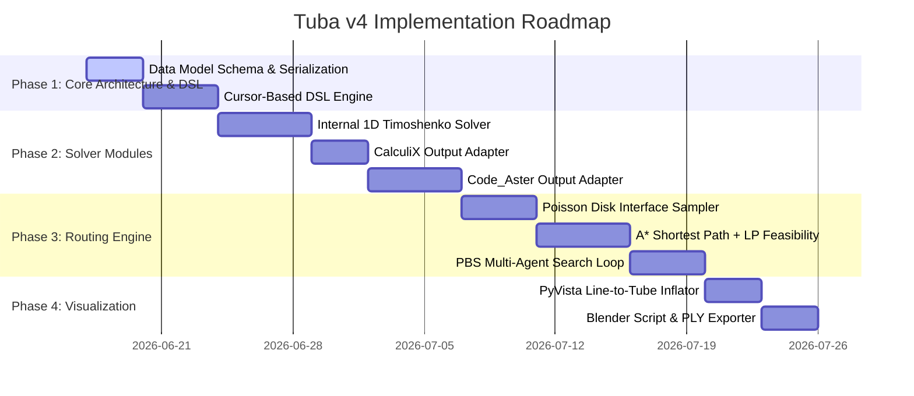

> **⚠️ HISTORICAL — pre-implementation design note.** This document describes an
> earlier design and does **not** match the shipped code. In particular its
> "Pluggable Solver Architecture" (internal Timoshenko / CalculiX / Code_Aster
> backends) and the `bend(..., plane='XY')` DSL were never built or were
> deliberately replaced — the product ships Code_Aster only. For current,
> authoritative behavior see `README.md`, `AGENTS.md`, the `notebooks/00`–`08`
> course, and `docs/architecture/`.

# Tuba v4: Detailed Technical Specification & Work Plan

---

## 1. Core Data Model & JSON Schema Spec

Tuba v4 uses a canonical, fully serializable JSON representation of the entire plant section. This format is the single source of truth, enabling easy ingestion by LLMs and structural data exchange.

### JSON Schema Definition (`tuba_model_schema.json`)

```json
{
  "$schema": "http://json-schema.org/draft-07/schema#",
  "title": "TubaModel",
  "type": "object",
  "properties": {
    "meta": {
      "type": "object",
      "properties": {
        "project_name": { "type": "string" },
        "standard": { "type": "string", "enum": ["ASME_B31.3", "EN_13480", "ASME_B31.1"] },
        "version": { "type": "string" }
      },
      "required": ["standard"]
    },
    "materials": {
      "type": "object",
      "additionalProperties": {
        "type": "object",
        "properties": {
          "E": { "type": "number", "description": "Young's modulus in Pa" },
          "nu": { "type": "number", "description": "Poisson's ratio" },
          "rho": { "type": "number", "description": "Density in kg/m3" },
          "alpha": { "type": "number", "description": "Mean thermal expansion coefficient 1/K" },
          "allowable_stress": {
            "type": "object",
            "additionalProperties": { "type": "number" },
            "description": "Temperature (C) to allowable stress (Pa) mapping"
          }
        },
        "required": ["E", "nu", "rho"]
      }
    },
    "sections": {
      "type": "object",
      "additionalProperties": {
        "type": "object",
        "properties": {
          "type": { "type": "string", "enum": ["pipe", "i_beam", "h_beam", "rect_tube", "round_bar"] },
          "OD": { "type": "number", "description": "Outer diameter in m" },
          "WT": { "type": "number", "description": "Wall thickness in m" },
          "corrosion_allowance": { "type": "number", "default": 0 },
          "h": { "type": "number", "description": "Height in m for profile sections" },
          "b": { "type": "number", "description": "Width in m for profile sections" },
          "tw": { "type": "number", "description": "Web thickness in m" },
          "tf": { "type": "number", "description": "Flange thickness in m" }
        },
        "required": ["type"]
      }
    },
    "nodes": {
      "type": "object",
      "additionalProperties": {
        "type": "array",
        "items": { "type": "number" },
        "minItems": 3,
        "maxItems": 3
      }
    },
    "elements": {
      "type": "array",
      "items": {
        "type": "object",
        "properties": {
          "id": { "type": "string" },
          "type": { "type": "string", "enum": ["pipe_straight", "pipe_bend", "beam"] },
          "n1": { "type": "string" },
          "n2": { "type": "string" },
          "section": { "type": "string" },
          "material": { "type": "string" },
          "bend_radius": { "type": "number" },
          "bend_angle": { "type": "number" }
        },
        "required": ["id", "type", "n1", "n2", "section", "material"]
      }
    },
    "supports": {
      "type": "array",
      "items": {
        "type": "object",
        "properties": {
          "node": { "type": "string" },
          "type": { "type": "string", "enum": ["anchor", "guide", "rest", "spring", "hanger"] },
          "direction": { "type": "array", "items": { "type": "number" }, "minItems": 3, "maxItems": 3 },
          "stiffness": { "type": "number", "description": "Spring stiffness in N/m" }
        },
        "required": ["node", "type"]
      }
    },
    "obstacles": {
      "type": "array",
      "items": {
        "type": "object",
        "properties": {
          "id": { "type": "string" },
          "type": { "type": "string", "enum": ["cuboid", "cylinder"] },
          "min_point": { "type": "array", "items": { "type": "number" }, "minItems": 3, "maxItems": 3 },
          "max_point": { "type": "array", "items": { "type": "number" }, "minItems": 3, "maxItems": 3 }
        },
        "required": ["id", "type", "min_point", "max_point"]
      }
    },
    "load_cases": {
      "type": "object",
      "additionalProperties": {
        "type": "object",
        "properties": {
          "gravity": { "type": "boolean", "default": true },
          "internal_pressure": { "type": "number", "description": "Pressure in Pa" },
          "temperature": { "type": "number", "description": "Design temperature in C" }
        }
      }
    }
  },
  "required": ["meta", "materials", "sections", "nodes", "elements", "supports"]
}
```

---

## 2. Cursor-Based DSL Spec

The procedural, cursor-based DSL acts as a high-level API for constructing the model programmatically or via AI tool calls. It wraps coordinates and topology builder steps, outputting the canonical JSON schema.

### DSL Classes & Key Method Signatures

```python
class PipingBuilder:
    def __init__(self, model: TubaModel, section_name: str, material_name: str):
        self.model = model
        self.section_name = section_name
        self.material_name = material_name
        self.cursor = np.array([0.0, 0.0, 0.0])
        self.direction = np.array([1.0, 0.0, 0.0]) # Running forward vector
        self.up_vector = np.array([0.0, 0.0, 1.0])
        self.last_node_id = None
        self.segment_counter = 0

    def start(self, point: List[float], support_type: str = None) -> 'PipingBuilder':
        """Sets the cursor position and initializes the starting node."""
        self.cursor = np.array(point)
        node_id = self.model.add_node(self.cursor)
        self.last_node_id = node_id
        if support_type:
            self.model.add_support(node_id, support_type)
        return self

    def run(self, length: float) -> 'PipingBuilder':
        """Creates a straight pipe segment in the current direction direction."""
        target_point = self.cursor + self.direction * length
        node_id = self.model.add_node(target_point)
        element_id = f"pipe_str_{self.segment_counter}"
        self.segment_counter += 1
        
        self.model.add_element(
            id=element_id,
            type="pipe_straight",
            n1=self.last_node_id,
            n2=node_id,
            section=self.section_name,
            material=self.material_name
        )
        self.cursor = target_point
        self.last_node_id = node_id
        return self

    def bend(self, radius: float, angle: float, plane: str = "XY") -> 'PipingBuilder':
        """
        Inserts an elbow/bend element.
        Rotates the forward direction vector and advances the cursor to the exit point.
        """
        # 1. Determine rotation axis based on plane (e.g. XY plane rotations occur around Z axis)
        if plane == "XY":
            axis = self.up_vector
        elif plane == "XZ":
            axis = np.cross(self.direction, self.up_vector)
            axis = axis / np.linalg.norm(axis)
        else: # YZ or arbitrary
            axis = self.direction
        
        # 2. Compute rotation matrix
        theta = np.radians(angle)
        rot = scipy.spatial.transform.Rotation.from_rotvec(axis * theta)
        
        # 3. Calculate tangent intersection point and end point
        # For simplified 1D modeling, bends can be modeled with intermediate nodes
        # or curved arc geometry. Here, we rotate the direction vector.
        new_direction = rot.apply(self.direction)
        
        # Advance cursor by tangent length
        tangent_len = radius * np.tan(theta / 2.0)
        bend_center_node_id = self.model.add_node(self.cursor + self.direction * tangent_len)
        
        target_point = self.cursor + self.direction * tangent_len + new_direction * tangent_len
        end_node_id = self.model.add_node(target_point)
        
        element_id = f"pipe_bend_{self.segment_counter}"
        self.segment_counter += 1
        
        self.model.add_element(
            id=element_id,
            type="pipe_bend",
            n1=self.last_node_id,
            n2=end_node_id,
            section=self.section_name,
            material=self.material_name,
            bend_radius=radius,
            bend_angle=angle
        )
        
        self.direction = new_direction
        self.cursor = target_point
        self.last_node_id = end_node_id
        return self

    def add_support(self, type: str, direction: List[float] = None) -> 'PipingBuilder':
        """Attaches a support boundary condition to the last created node."""
        self.model.add_support(self.last_node_id, type, direction)
        return self
```

---

## 3. Pluggable Solver Architecture

Tuba v4 isolates the mathematical FEA execution from the core data model. Solvers must implement the `BaseSolver` interface.

```python
class BaseSolver(ABC):
    @abstractmethod
    def solve(self, model: TubaModel, load_case_name: str) -> 'FEAResults':
        """
        Takes a TubaModel and runs FEA simulation.
        Returns a FEAResults container containing displacement, stress, and reactions.
        """
        pass
```

### Backend A: Internal Python Timoshenko Beam Solver (`tuba/solver/internal.py`)
To avoid compiling large external binaries or running virtualized environments during rapid prototyping or route optimization.
- **Formulation**: 3D Space Frame Element (6 degrees of freedom per node: $u, v, w, \theta_x, \theta_y, \theta_z$).
- **Stiffness Matrix ($K_e$)**: Incorporates shear deformation (Timoshenko parameter $\Phi$) to accurately model stubby pipe sections:
  $$\Phi_y = \frac{12 E I_z}{G A_s L^2}, \quad \Phi_z = \frac{12 E I_y}{G A_s L^2}$$
- **Output**: Returns Node displacements ($D$) and internal forces ($F = K_e d$) which are mapped back to axial, bending, and torsional stress.

### Backend B: CalculiX Adapter (`tuba/solver/calculix.py`)
Provides a lightweight, open-source 3D structural solver that runs natively on Windows/Linux.
- **Element Mapping**:
  - `pipe_straight` $\rightarrow$ `*BEAM SECTION, SECTION=PIPE` using standard 2-node linear beam elements (`B31`).
  - `pipe_bend` $\rightarrow$ Discretized into a series of short straight `B31` elements to approximate the curve.
- **Execution Flow**:
  1. Write `.inp` text file containing node arrays, element definitions, section definitions, and step cards (`*STATIC`).
  2. Spawn local shell process running `ccx` (CalculiX Solver).
  3. Parse the output `.dat` or `.frd` file for displacement and axial/bending stresses.

### Backend C: Code_Aster Adapter (`tuba/solver/code_aster.py`)
High-fidelity solver backend running inside a containerized or WSL environment.
- **Element Mapping**:
  - `pipe_straight` / `pipe_bend` $\rightarrow$ `MODELISATION='TUYAU_3M'` (or `TUYAU_6M` for thin-walled ovalization modeling).
  - `beam` $\rightarrow$ `MODELISATION='POU_D_T'` (Timoshenko Beam).
- **Elbow Modeling**: Code_Aster's `TUYAU` element handles curvature natively with `AFFE_CARA_ELEM` `COUDE` keyword:
  ```
  carac = AFFE_CARA_ELEM(
      VALE_IDEF=(
          _F(GROUP_MA='Elbows', RAYON_COUDE=0.2286, EPAIS=0.00711, CARA='RAYON')
      )
  )
  ```

---

## 4. Pluggable 3D Routing & Optimization Spec

Automatic routing requires search-based solvers to navigate around obstacles while minimizing stress-related costs (bends, span length, support proximity).

### A. Graph Discretization & Bridson's Poisson Disk Sampling
Following Stanczak et al., the 3D continuous space is divided into convex polyhedral cells (or a bounding voxel grid). 
1. **Interfaces**: The boundary surfaces between adjacent cells are identified.
2. **Poisson Disk Sampling**: Bridson's algorithm is run to sample points on each interface with radius $\rho$:
   - For an interface $i$, select a point, generate candidate points within $[r, 2r]$, reject points closer than $r$ to existing points, and repeat until no new points can be placed.
3. **Connectivity Graph $G(M, D)$**: Sampled points on interface $i$ of cell $c$ are fully connected to all sampled points on interface $i'$ of cell $c$. The edge weight equals the Euclidean distance.

```
      Cell C1                      Cell C2
┌──────────────────┐        ┌──────────────────┐
│                  │        │                  │
│   ● Node A       │        │                  │
│    \             │        │                  │
│     \            │        │                  │
│    Interface 1   │        │   Interface 2    │
│     [●] ─── (Edge) ───────► [●]              │
│    Point 1       │        │  Point 2         │
│                  │        │    \             │
│                  │        │     \            │
│                  │        │      ● Node B    │
└──────────────────┘        └──────────────────┘
```

### B. LP-Based Feasibility Checker ($LP_s$)
For a candidate path through a sequence of interfaces, a Linear Program is solved to find the exact continuous coordinates of the nodes:

$$\text{Minimize} \quad \sum_{i=1}^{N_s} \ell_i$$

**Subject to:**
1. **Interface Boundaries**: Point $q_{i,j}$ must lie on interface polygon $P_j$:
   $$A_j q_{i,j} \le b_j$$
2. **Straight Line Constraints**: Segments between bends must be straight lines matching the pipe's forward direction:
   $$P_{i+1} - P_i = \ell_i \cdot e_{s,i}$$
3. **Minimum Length**: Straight runs must exceed the minimum manufacturing/support length plus bend half-lengths:
   $$\ell_i \ge L_{b,i-1} + L_{min} + L_{b,i}$$

### C. Multi-Agent Pathfinding via Priority-Based Search (PBS)
For multiple colliding pipes, PBS solves the coordination problem:
1. **Root Node**: Route each pipe independently ignoring others.
2. **Collision Check**: If pipe $p_1$ and $p_2$ collide in 3D:
   - Identify conflict $C = (p_1, p_2)$.
3. **Branching**: Create two child nodes in the Conflict Tree (CT):
   - **Branch 1**: Add constraint $p_1 \prec p_2$ ($p_1$ has priority; $p_2$ must treat $p_1$'s routed volume as an obstacle). Replanning $p_2$.
   - **Branch 2**: Add constraint $p_2 \prec p_1$. Replanning $p_1$.
4. **Search**: Explore Conflict Tree using Depth-First Search with cost-based bounding (backtracking if unrouted pipes exceed `maxMissing`).

---

## 5. Code_Aster Command Reference Guide

This curated cheat-sheet guides the generator in creating robust Code_Aster command scripts for 1D pipe stress.

```python
# AFFE_MODELE: Set up the pipe modelisation
mod = AFFE_MODELE(
    MAILLAGE=mesh,
    AFFE=_F(
        TOUT='OUI',
        PHENOMENE='MECANIQUE',
        MODELISATION='TUYAU_3M'  # 1D pipe elements with Fourier modes
    )
)

# DEFI_MATERIAU: Define steel material with temperature dependent elasticity
mat = DEFI_MATERIAU(
    ELAS=_F(
        E=2.1e11,
        NU=0.3,
        RHO=7850.0,
        ALPHA=1.2e-5
    )
)

# AFFE_CARA_ELEM: Set section parameters (OD, WT, pressure correction)
cara = AFFE_CARA_ELEM(
    TUYAU=_F(
        GROUP_MA='PipeStraights',
        EPAIS=0.00711,      # Wall thickness
        RAYON=0.0841,       # Outer radius (OD/2)
        VECT_DIR=(0, 0, 1), # Local orientation vector
    ),
    COUDE=_F(
        GROUP_MA='PipeElbows',
        RAYON_COUDE=0.2286, # Bend radius
        RAYON=0.0841,
        EPAIS=0.00711
    )
)

# AFFE_CHAR_MECA: Apply thermal expansion & internal pressure
load = AFFE_CHAR_MECA(
    MODELE=mod,
    PRES_IMPO=_F(
        GROUP_MA='AllPipes',
        PRES=2.0e6  # 2.0 MPa internal pressure
    ),
    TEMP_IMPO=_F(
        GROUP_MA='AllPipes',
        TEMP=200.0  # 200C design temperature
    )
)
```

---

## 6. Blender & Visualizer Specification

Visualizing 1D line meshes requires translating lines to 3D surfaces with mapped stress scalar values.

### The Viz Pipeline

```
Code_Aster (.rmed) ────► meshio ────► PyVista (.vtu)
                                          │
                                          ├────► Inflate 1D lines to 3D Tubes (.tube)
                                          │
                                          ├────► Map Von Mises stress scalar fields
                                          │
                                          └────► Export to PLY (with vertex colors)
                                                     │
                                                     ▼
                                              Blender Import
```

### Blender vertex color reading material node tree:

```
[Vertex Color Shader Node] (Col) ──► [Base Color] of [Principled BSDF]
                                     [Emission]   of [Principled BSDF]
```

---

## 7. Phased Implementation Work Plan



### Milestone Checklist

- [ ] **Milestone 1**: Core schema passes schema validation. Script constructs 3D loops using cursor DSL, exports to valid JSON.
- [ ] **Milestone 2**: Internal solver and CalculiX outputs match standard beam test cases within a 1% threshold.
- [ ] **Milestone 3**: Routing algorithm successfully routes a single pipe around a block obstacle in a 3D bounding box.
- [ ] **Milestone 4**: Multi-agent router (PBS) routes three pipes simultaneously without self-collisions.
- [ ] **Milestone 5**: Interactive 3D plot displays Von Mises stress heatmap in Jupyter and exports PLY files to Blender.
